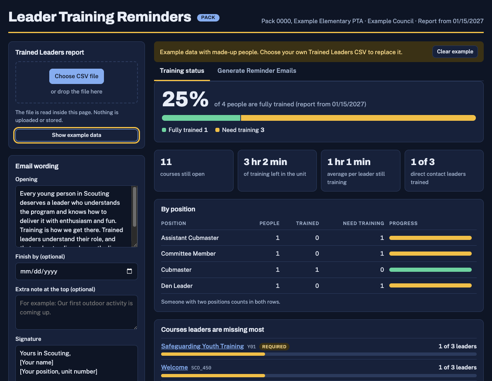

# Scouting Commissioner Tools Plus

Scouting America provides commissioners with a number of tools to support units. They are collected on the [commissioner tools](https://www.scouting.org/commissioners/tools/) page.

These tools can sometimes be cumbersome to use. This repository's intent is to offer enhanced tools that help manage communication and analysis of unit health.

## Tools

1. [Leader Training Reminders](#leader-training-reminders): the first tool.

## Leader Training Reminders

A single-page tool for unit commissioners. Load a Scouting America **Trained Leaders** status report (CSV) and it will:

- show where the unit stands on training (percent trained, courses missed most, leaders closest to finishing)
- translate course codes such as `SCO_454` or `Y01` into plain course names with direct links to [training.scouting.org](https://training.scouting.org)
- draft a personal reminder email for each leader who still has courses to take, with copy and bulk-copy options
- match its colors to the unit type (Pack, Troop, Crew or Ship)

*The Training status tab with made-up example data. The badge next to the title and the color scheme follow the unit type found in the report.*

### What you see

**Left column: set up**

- **Trained Leaders report:** choose the CSV or drop it on the box. "Show example data" loads made-up people so you can look around first.
- **Email wording:** the opening paragraph that explains why training matters (edit it freely), an optional finish-by date, an optional extra note, and your signature. Your wording and signature are remembered in your browser.

**Training status tab (opens first)**

- **Headline:** the percent of people fully trained, with a bar splitting fully trained from needs training.
- **Unit totals:** courses still open, total training time left, the average per leader who still has courses to take, and how many direct-contact leaders are trained.
- **By position:** people, trained and still needing training for each position, with a progress bar.
- **Courses leaders are missing most:** each course in plain language, linked to its page on training.scouting.org, with how many leaders still need it. Courses that are required for a position are tagged **Required**. Below that, the leaders closest to finishing, so a quick nudge can get them over the line.

**Generate Reminder Emails tab**

- One card per leader who still has courses to take, listing each course by name with its link and minutes.
- A personal email for each leader: open it in your mail app, copy the email, or copy the address.
- Bulk options to copy all addresses (comma or semicolon separated), all drafts, or a mail-merge table.
- Leaders with no email address are flagged, and leaders whose online courses are done but whose report still lists a classroom course are listed for a check in My.Scouting instead of getting a reminder.

**Privacy:** the CSV is read in your browser and is never uploaded. The only things saved are your email wording and signature, in your browser's local storage on your own device.

### Use it

Open the GitHub Pages site for this repository and choose your CSV. The page opens on the cold-start screen until a report is loaded, and then lands on the Training status tab.

### Run it locally

Open `index.html` in a browser. There is no build step and no dependencies other than the Google Fonts stylesheet.

### Notes

- The course catalog (names, minutes, links) is embedded in `index.html` and was collected from the Scouting America training site. If a course code is not in it, the tool lists the code and links to the course page of the same code.
- Classroom courses are treated as complete once the online courses are done, so the emails point leaders to the online curriculum.
- The exception is S11, Introduction to Outdoor Leader Skills (IOLS). It is an in-person outdoor course, not an online one, and it is not in the online catalog. Even when a report lists it under the mandatory or online columns, it is shown as an in-person course named "Introduction to Outdoor Leader Skills (IOLS)" and links to the [course overview PDF](https://www.scouting.org/wp-content/uploads/2018/08/3364018OLskills_Aug.pdf). The email tells the leader to check their council's training calendar for the next available course date.
